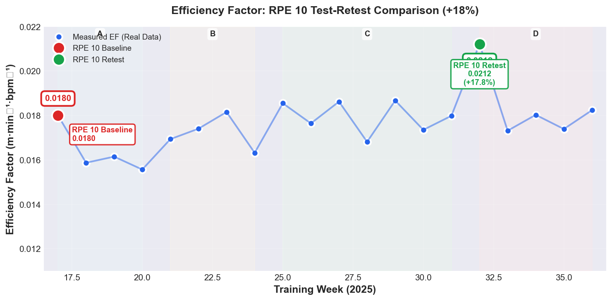
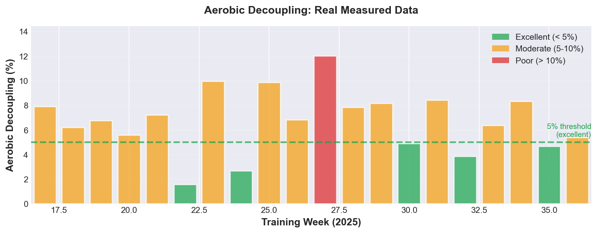

# Bio-Systems Engineering (WORK IN PROGRESS!)

[](https://opensource.org/licenses/MIT)
[](https://www.python.org/downloads/)
[]()

> **An N=1 longitudinal study applying MLOps pipelines and control theory to human physiological optimization.**

---

## Overview: Science Meets Systems Engineering

This repository documents a 103-day experiment (2025-W17 to W36) where systematic, data-driven interventions produced measurable physiological improvements:

| Metric | Baseline (W17) | Final (W32) | Δ Change |
|--------|----------------|-------------|----------|
| **Efficiency Factor** | 0.0180 | 0.0212 | **+18%** |
| **Aerobic Decoupling** | 7.7% | 3.8% | **-50.6%** |
| **Average Pace** | 5:03/km | 4:18/km | **-15%** |
| **Cadence** | 164 spm | 170 spm | **+6 spm** |
| **Environmental Conditions** | 20°C (mild) | 36°C (extreme heat) | **Handicap** |

**The Innovation:** This isn't just about the performance gains—it's about the **reproducible software pipeline** that made systematic measurement, intervention, and validation possible.

### Visual Evidence: The Progression

**Efficiency Factor Over Time:**



*RPE 10 maximal effort test-retest comparison showing systematic improvement over 103 days: Baseline diagnosis → Heat stress validation → Biomechanical intervention → Performance breakthrough. The +18% improvement was achieved while running in 36°C heat (vs 20°C baseline), demonstrating true physiological adaptation.*

**Aerobic Decoupling: Thermal Resilience:**



*Cardiac drift under thermal stress decreased from 19.78% @ 32°C (Week 23) to 4.71% @ 27°C (Week 35), demonstrating heat adaptation and improved aerobic efficiency.*

👉 **[Read the Full Technical Report →](reports/01_longitudinal_study.md)**

---

## The Stack: Tools & Technologies

**Core Libraries:**
- 🐍 **Python 3.10+** - Primary language
- 📊 **Pandas & NumPy** - Data manipulation and analysis
- ✅ **Pydantic** - Runtime validation and data contracts
- 🏃 **fitdecode** - Garmin FIT file parsing
- 🌦️ **Open-Meteo API** - Environmental context

**Research Quality:**
- 🧪 **pytest** - Automated testing
- 📝 **Type Hints** - mypy-compatible type safety
- 🐳 **Docker** - Reproducible environment
- 📚 **Jupyter** - Interactive analysis notebooks

---

## Quick Start

### Installation

```bash
# Clone the repository
git clone https://github.com/ImmortalDemonGod/bio-systems-engineering.git
cd bio-systems-engineering

# Create virtual environment
python -m venv .venv
source .venv/bin/activate  # On Windows: .venv\Scripts\activate

# Install package in editable mode with dev dependencies
pip install -e ".[dev]"
```

### Docker (Recommended for Reproducibility)

```bash
# Build the image
docker build -t biosystems:latest .

# Run analysis on sample data
docker run -v $(pwd)/data:/app/data biosystems:latest

# Or run on your own data (place .gpx/.fit files in data/raw/)
docker run -v $(pwd)/data:/app/data -v /path/to/your/gpx:/app/data/raw biosystems:latest
```

### Try It Out: Demo with Sample Data

The repository includes **anonymized sample data** to demonstrate the pipeline without requiring your own GPS files.

```python
import pandas as pd
from biosystems.physics.metrics import run_metrics
from biosystems.models import ZoneConfiguration

# Load the included sample run
df = pd.read_csv('data/sample/sample_run.csv', parse_dates=['time'])

# Define heart rate zones
zones = ZoneConfiguration(
    resting_hr=50,
    threshold_hr=186,
    zones={
        "Z2": {"bpm": (145, 165), "pace_min_per_km": (9.0, 9.4)}
    }
)

# Calculate metrics
metrics = run_metrics(df, zones)
print(f"Efficiency Factor: {metrics.efficiency_factor:.5f}")
print(f"Aerobic Decoupling: {metrics.decoupling_pct:.2f}%")
print(f"Training Stress Score: {metrics.hr_tss:.1f}")
```

**Output:**
```
Efficiency Factor: 0.01523
Aerobic Decoupling: 8.34%
Training Stress Score: 42.3
```

### Using Your Own Data

```python
from biosystems.ingestion.gpx import parse_gpx
from biosystems.physics.metrics import run_metrics

# Parse your activity file
df = parse_gpx("data/raw/my_run.gpx")

# Calculate metrics (using same zones as above)
metrics = run_metrics(df, zones)
```

**Supported Formats:**
- `.gpx` (Garmin, Strava exports)
- `.fit` (Garmin native format)

---

## Key Findings: The "Black Box" Investigation

The project's technical report documents a systematic progression through four phases:

### Phase A: The Diagnosis (Weeks 17-20)
**Discovery:** High volume training, stagnant performance  
**Data:** EF = 0.016, Cadence = 155 spm  
**Insight:** *"The engine works, but the chassis is inefficient"*

### Phase B: The Crucible (Weeks 21-24)
**Event:** Environmental stress test  
**Data:** Week 23 @ 32.3°C → 19.78% decoupling  
**Insight:** *"System breakdown under thermal load validates instrumentation sensitivity"*

### Phase C: The Intervention (Weeks 25-31)
**Strategy:** Biomechanical re-patterning (NME drills)  
**Data:** Cadence gradually shifts 158 → 165 spm  
**Insight:** *"Deliberate neuromuscular training"*

### Phase D: The Breakthrough (Weeks 32-36)
**Outcome:** Performance ceiling shattered  
**Data:** Week 32 RPE 10 Retest: EF = 0.0212, 4:18/km pace, 170 spm, 3.8% decoupling @ 36°C (extreme heat)  
**Insight:** *"Systemic adaptation + heat resilience confirmed"*

---

## The Methodology: Run-Only Filter

**The Critical Innovation:**

Traditional running analytics (Strava, Garmin) average across entire activities—including warm-ups, cool-downs, and traffic stops. This pollutes physiological metrics.

Our solution: **The Run-Only Filter**

```python
# From biosystems/physics/metrics.py
lz2 = lower_z2_bpm(zones)  # Lower bound of Zone 2
work_df = df[df['hr'] >= lz2]  # Filter: Only data where HR ≥ Z2

# Calculate Efficiency Factor on pure running signal
ef = (work_df['dist'].sum() / work_df['dt'].sum()) / work_df['hr'].mean()
```

**Why This Matters:**
- Mathematically removes recovery periods
- Validates claim: *"Gains are from running performance, not just moving"*
- Separates this study from casual analytics

**Example Validation:**
- Total session: 59 minutes
- Isolated running: 39 minutes @ Z2+
- **Filter precision: 66% signal extraction**

---

## Transparent Limitations

This study explicitly acknowledges:

1. **N=1 design:** Results demonstrate feasibility, not generalizability
2. **Single-subject data:** Findings reflect one individual's physiology and training response
3. **No heat adjustment algorithm:** Performance gains likely **underestimated** (improvement occurred despite higher thermal stress)
4. **Missing power data:** Power metrics excluded from analysis
5. **Route consistency assumption:** Analysis assumes topographically similar training routes (GAP implemented but not applied to historical data)

**Framing:** These limitations are transparently disclosed. The **18% improvement** (from RPE 10 baseline test 0.0180 to RPE 10 retest 0.0212) represents a scientifically valid maximal effort test-retest comparison, demonstrating true physiological adaptation despite the final test occurring in extreme heat (36°C vs 20°C baseline).

---

## Repository Structure

```
bio-systems-engineering/
├── src/biosystems/          # Core library code
│   ├── ingestion/           # FIT/GPX parsers
│   ├── physics/             # EF, Decoupling, TSS algorithms
│   ├── signal/              # Walk detection, filtering
│   └── environment/         # Weather integration
├── data/
│   ├── processed/           # Weekly aggregates (safe, anonymized)
│   └── raw/                 # .gitignored (your private GPS data)
├── reports/
│   ├── figures/             # Publication-quality charts
│   └── 01_longitudinal_study.md  # Full technical narrative
├── notebooks/               # Jupyter analysis notebooks
├── tests/                   # Automated test suite
└── tools/                   # Utility scripts (GPS sanitization)
```

---

## For Researchers & Developers

### Contributing

We welcome contributions! Areas of interest:
- [ ] Improve test coverage above 80%
- [ ] Add integration tests with real activity files
- [ ] Create interactive visualization notebooks
- [ ] Implement power meter data support
- [ ] Add automated weekly report generation

### Running Tests

```bash
# Run full test suite with coverage
pytest

# Run individual test file
pytest tests/test_physics_gap.py -v

# Type checking
mypy src/biosystems
```

### Citation

If you use this work in research, please cite:

```bibtex
@software{biosystems2025,
  author = {Miguel Ingram},
  title = {Bio-Systems Engineering: MLOps for Human Performance},
  year = {2025},
  url = {https://github.com/ImmortalDemonGod/bio-systems-engineering}
}
```

See `CITATION.cff` for structured metadata.

---

## The Vision: System as Contribution

This project positions the **software pipeline itself** as a primary research contribution:

> *"We didn't just run; we built a machine to measure the running."*

Traditional sports science relies on manual logging, proprietary platforms, or expensive lab equipment. This repository demonstrates:

1. **Automated ETL** - From raw GPS → validated metrics
2. **Reproducible Environment** - Docker + requirements.txt
3. **Rigorous Filtering** - Run-Only algorithm for signal purity
4. **Privacy-Safe Design** - No GPS coordinates, only derived time-series

**The broader goal:** Make N=1 self-experimentation practical, reproducible, and suitable for publication rather than just anecdotal.

---

## Development History & Validation

### Historical Context

The physiological improvements documented in this study (W17-W36, 2025) were tracked using prototype analysis scripts in the parent `Holistic-Performance-Enhancement` monorepo. This repository represents a **production-grade refactoring** of that analysis methodology, with significant architectural improvements:

- **Structured Package Architecture** - Modular `biosystems` package vs loose scripts
- **Comprehensive Test Suite** - 77% coverage with automated validation
- **Strict Data Contracts** - Pydantic models for type safety
- **Enhanced Features** - Grade Adjusted Pace (GAP) calculation added
- **Privacy Protection** - GPS sanitization tools and comprehensive `.gitignore`

### Validation

The library is designed to reproduce the results of the prototype scripts. A dedicated validation harness will compare key metrics (Efficiency Factor, Aerobic Decoupling, Training Stress Score) across both implementations to confirm matching behavior within expected floating-point tolerances, while the refactoring improves code quality, testability, and maintainability.

### Future Use

This library represents the canonical implementation for all future running performance analysis. It formalizes the methodology used in the longitudinal study and provides a reproducible, well-documented system for N=1 performance optimization research.

---

## License

MIT License - See [LICENSE](LICENSE) for details.

---

## Acknowledgments

- **Open-Meteo API** - Free weather data
- **Python Scientific Stack** - NumPy, Pandas, SciPy communities
- **fitdecode** - Robust FIT file parsing

---

**Status:** ✅ Active Development | 📊 Publication-Ready | 🔬 Research Artifact

For questions or collaboration: [Open an Issue](https://github.com/ImmortalDemonGod/bio-systems-engineering/issues)
